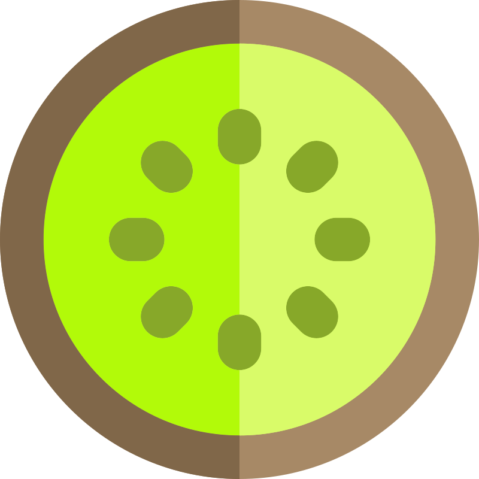
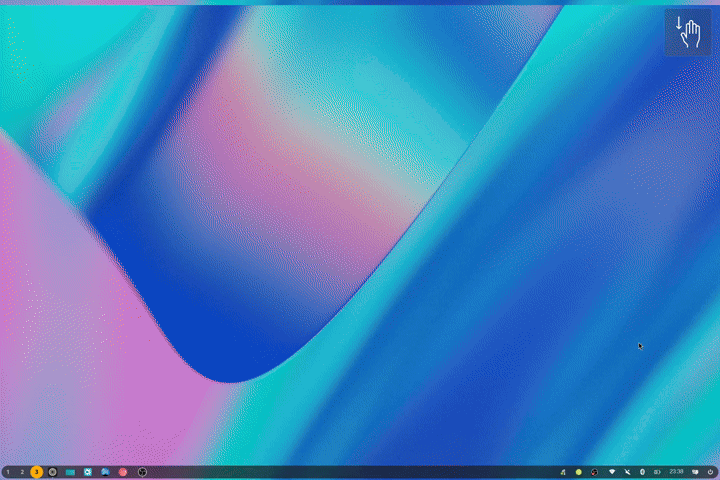

<p align="center">
  
</p>

# Kiwi

A key visualizer for [COSMIC DE](https://github.com/pop-os/cosmic-epoch). Shows an overlay of your keystrokes, mouse clicks, gestures, and touchscreen input.



## Features

- Real-time keystroke visualization overlay
- Mouse button and scroll wheel display
- Touchpad gesture recognition (swipes, holds)
- Touchscreen contact markers (shows where your fingers are touching)
- Tablet pen taps, drags, eraser, barrel buttons, and pad buttons
- System tray integration
- Configurable position, size, colors, and ...
- Multiple color palettes, plus Mechanical and Mac keycap themes
- Custom themes with your own icons and keycaps

## Requirements

- COSMIC DE
- Rust
- [just](https://github.com/casey/just)
- User must be in the `input` group (for libinput access)

## Build

```bash
just build-release
```

## Install

```bash
sudo just install
```

This installs to `/usr/bin/kiwi` along with desktop entry and icons.

## Uninstall

```bash
sudo just uninstall
```

## Setup

### Add yourself to the input group

Kiwi uses libinput to capture keystrokes, which requires read access to `/dev/input/*` devices:

```bash
sudo usermod -aG input $USER
```

**Log out and log back in** for the group change to take effect.

### Verify group membership

```bash
groups | grep input
```

## Usage

Launch Kiwi from your application menu or run:

```bash
kiwi
```

Kiwi runs as a tray icon. Click the tray icon to toggle the overlay. Right-click for settings and quit options.

## Configuration

Settings are stored via cosmic-config and can be accessed through the tray icon menu.

## Security

Adding yourself to the `input` group grants read access to all input devices (`/dev/input/*`). This means any program you run can read all keystrokes, including passwords. Only do this on systems you trust and where you control what software runs.

## Why Kiwi?
It's a Key Visualizer!

## Credits

The Mechanical and Mac themes use artwork from other projects, each with its own license:

- Keycaps from [Free Keyboard Graphics](https://github.com/q2apro/keyboard-keys-speedflips) by q2apro: public domain
- Key legends from [Misonocons](https://github.com/misonoworks/misonocons) by MisonoWorks: [CC BY 4.0](https://creativecommons.org/licenses/by/4.0/)
- Mac keys from [SVG Keyboard Icons](https://github.com/georgemblack/svg-keyboard-icons) by George Black: MIT

What was changed, and the full license texts, are in `data/themes/*/`. The settings window and the About page list them too.
